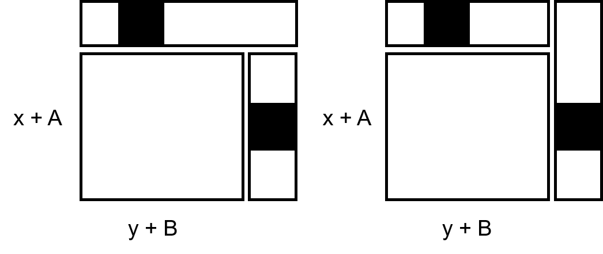

## 参加記

AB2完、102:27でした。
Bはもう少し早く解けたなぁ、という印象ですが、それ以上は歯が立たず。

## B. Extension

[問題](https://atcoder.jp/contests/agc046/tasks/agc046_b)

---

制約から、$\mathcal{O}(N^2)$のDPがパッと思いつきます。

$f(x, y) :=$ 縦に$x$マス、横に$y$マス拡張したときの場合の数

として、遷移を考えてみます。

このとき、マス目は、縦$x + A$マス、横$y + B$マスとなっています。

したがって、
- $f(x + 1, y) = f(x, y) * (y + B)$

- $f(x, y + 1) = f(x, y) * (x + A)$

より、

$f(x + 1, y + 1) = f(x, y + 1) * (y + B + 1) + f(x + 1, y) * (x + A + 1)$

が成り立ちそうな気がしてきます。

しかし、実は

$f(x, y) \rightarrow f(x + 1, y) \rightarrow f(x + 1, y + 1)$

と

$f(x, y) \rightarrow f(x, y + 1) \rightarrow f(x + 1, y + 1)$

の遷移で以下のように二回同じ状態を数えている部分があります。

この重複してる部分の場合の数は、$(x + A)(y + B)$通りあるので、最終的な遷移は

$f(x + 1, y + 1) =  (y + B + 1)f(x, y + 1) + (x + A + 1)f(x + 1, y) - (x + A)(y + B)f(x, y)$

となります。よって、以下の動的計画法で解くことができます。

---

初期値 : $f(0, 0) = 1$

更新式 : $f(x, y) = (y + B)f(x - 1, y)(x \geq 1) + (x + A)f(x, y - 1)(y \geq 1) - (x + A - 1)(y + B - 1)f(x - 1, y - 1)(x \geq 1 ~ \& ~ y \geq 1)$

答え : $f(C - A, D - B)$

---

一度分かってしまえば簡単なんですが、重複部分の考察は結構難しい気がします。
